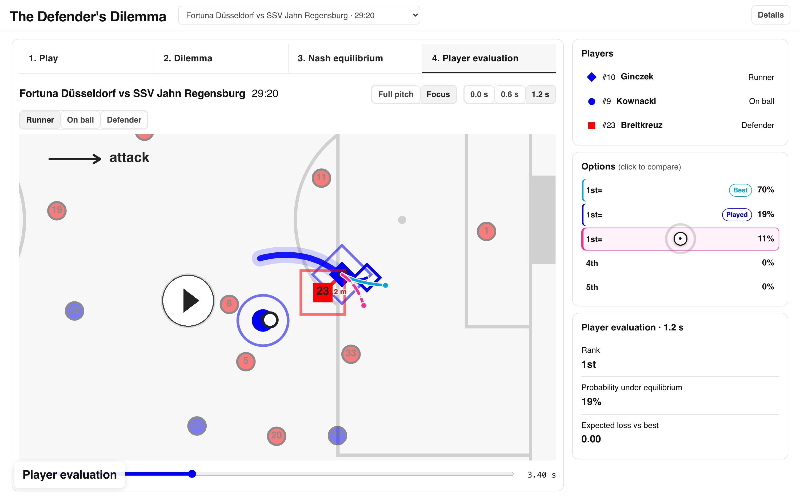

# The Defender’s Dilemma: Game-Theoretic Evaluation of Off-Ball Movement in Soccer

**Kyuhyeok Seo**, **Chan-Eui Song**, **Andrew Kang**, **Priya Narasimhan**, **James Z. Wang**

An off-ball run can force a defender to choose between following the runner and covering another
attacker. We identify such situations in the IDSSE tracking dataset, model each as a small game
between two attackers and one defender, and solve the game at 0.6 s intervals for its Nash
equilibrium. The equilibrium describes how both sides should move when each can respond
strategically to the other.

## Interactive demo

**[OPEN INTERACTIVE DEMO](https://chani-song.github.io/offball-value/)**

[](https://chani-song.github.io/offball-value/)

### Demo tour

[](docs/assets/demo_tour.mp4)

## Key figures


## Method

**Players.** Each scene has three roles: the runner, the defender responsible for the runner, and the
beneficiary, the teammate who gains if the defender follows the runner. There are two kinds of game:

- **2v1** (`andrew-passer2on1/`): the beneficiary is the ball carrier. The ball carrier and the
  runner play against the defender.
- **3v1** (`andrew-fixedpasser/`): the beneficiary is another teammate. The ball carrier follows
  their real path and can only pass; the runner and the beneficiary play against the defender.

**Scenes.** Run onsets are detected inside settled attacking possessions in the seven IDSSE matches:
a change of direction of at least 25 degrees with a speed gain of at least 1.5 m/s. In pipeline scenes
a rule assigns the three roles; in annotated scenes they come from the annotator's labels.

**Game.** Each game has three simultaneous decisions of 0.6 s (a 1.8 s horizon). The defender chooses
one of five movement commands: stop, or move in one of four directions relative to the attack. The
attack chooses a joint command for its two players, or a pass. Pass candidates are aimed along the
receiver's run. All movement respects speed-up, braking and turning limits measured from the same
tracking data (99.9th percentile). All other players follow their real tracked paths. In 2v1 games
the other defenders can still tackle the ball carrier. A pass is worth its completion probability
times a hand-designed positional threat at its target. Completion probabilities come from a pass
model fitted on passes from these matches; each scene uses a fit that leaves out its own match.

**Solution.** The game is zero-sum and finite, and is solved backwards with a linear program at every
decision state. Each solution is checked against unrestricted best responses for both sides: the
certificate gap must be within the solver's tolerance. The result is a behaviour strategy, a mixed
choice at every decision state. Each real moment (0.0, 0.6 and 1.2 s after the start) is solved as a
separate game.

The probabilities in the code output and the figures are the probabilities the equilibrium strategy
puts on each action. They are not pass-completion probabilities, and they do not say how likely an
action is to be correct.

Both games build on a finite-game solver by Andrew Kang (`defensive_positioning`). Design notes for
each game are in `andrew-passer2on1/DESIGN.md` and `andrew-fixedpasser/DESIGN.md`.

## Results

The evaluation set has 26 scenes from the rated pool: 7 from a team member's annotated shot clips and
19 from the pipeline. Together they give 69 real moments and 207 player decisions.

| Result in the abstract | How it is computed |
| --- | --- |
| The equilibrium mixes in 48% of moments | the defender mixes at 33 of 69 moments (`scripts/analyze_eval.py`) |
| Optimal attack against the fixed, observed defense exceeds the equilibrium value by 6% on average and up to 21% | `(S - V) / V` from `scripts/static_counterfactual.py` and `scripts/summarize_static.py` |

The output files of both analyses are not in the repository. The first number was recomputed from the
2026-09-30 evaluation output; the second could not be re-run outside the cluster
([docs/reproduction.md](docs/reproduction.md)).

`scripts/analyze_eval.py` also ranks each player's observed option among their five or six options,
by its value against the opponent's equilibrium strategy. These numbers are not in the abstract.

| | Observed | Uniform choice |
| --- | --- | --- |
| Median rank of the observed option (ties share places) | 2.0 | 3.0 |
| Mean equilibrium probability of the observed option | 0.31 | 0.19 |

Caveats:

- The observed option is the command whose 0.6 s end point is nearest the player's real position
  (median distance 0.78 m), so it is an approximation.
- Ties are common: 42.5% of observed options tie with another option.
- The evaluation set is small, includes the figure scene, and was drawn from scenes selected for a
  dilemma rating.

## Code

| Step | Where |
| --- | --- |
| Run onsets and scenes | `scripts/extract_settled_possession_run_onsets.py`, `apply_pair_gate.py`, `build_stage3_states.py` |
| Pass model and movement limits | `scripts/fit_pass_sym.py`, `scripts/measure_accelerations.py` |
| Game states | `scripts/build_showcase_states.py`, `scripts/build_eval_states.py` |
| Games and solver runs | `andrew-passer2on1/`, `andrew-fixedpasser/` (each run by its own `scripts/run.py`); SLURM jobs in `jobs/` |
| Evaluation | `scripts/analyze_eval.py`, `scripts/static_counterfactual.py`, `scripts/summarize_static.py` |
| Figures | `scripts/render_figure1_dilemma.py`, `scripts/render_figure2_abstract.py`, `scripts/add_caption.py` |
| Demo | `demo_viz/` ([demo_viz/README.md](demo_viz/README.md)) |

```text
andrew-passer2on1/    2v1 game: package, solver run script, design notes, check scripts
andrew-fixedpasser/   3v1 game (scripted passer), same layout
src/offball_value/    tracking loaders, run-onset detection, scene construction
scripts/              pipeline steps, evaluation, figures
jobs/                 SLURM scripts for the solver runs
demo_viz/             interactive demo
data/processed/       fitted pass-model coefficients and measured movement limits
data/static/          static EPV grid (from PAUSA, Apache-2.0)
tests/                unit tests
docs/                 reproduction, data and code status; docs/assets/ holds the README images
```

`src/offball_value/` also contains modules from earlier versions of the method that are no longer on
the paper's path. [docs/code_status.md](docs/code_status.md) lists which code is on the paper's path,
which supports it, and which is left over.

## Reproducing

| What | Needs |
| --- | --- |
| Unit tests | this repository only (run in CI) |
| Pass model and movement limits | the IDSSE files, to refit them (the fitted outputs are committed) |
| Scenes, game states, solver runs | the IDSSE files, the private solver base and a SLURM cluster; the showcase scenes also need the team's annotation sheets |
| Figure 1 | the solver output for S05 and a start sheet, neither in the repository |
| Figure 2 | the S05 panels, defender grids and tracking excerpt, none in the repository |
| Evaluation numbers | the evaluation run's solver output and the IDSSE files |

Full solver reproduction requires the `defensive_positioning` solver base; see
[docs/reproduction.md](docs/reproduction.md#solver-base). Commands, inputs and what was checked are in
the same document.

`docs/assets/figure1_ssac.pdf` and `figure2_ssac.pdf` are the submitted figures; the PNGs are full-page
renders of them. Figure 1 is drawn from the tracking; only its Future 2 panel uses the solver (the
through ball's target and the defender's motion). Figure 2 is solver output. The demo screenshot and
the demo tour are recorded from the deployed demo at
[chani-song.github.io/offball-value](https://chani-song.github.io/offball-value/).

## Data

The tracking and event data are IDSSE (Bassek et al., 2025; CC BY 4.0; data owner DFL), which covers
seven Bundesliga matches. Download them separately into `data/raw/bundesliga-integrated/`. The
repository includes only fitted coefficients and measured limits derived from them, plus the README
images. [docs/data.md](docs/data.md) lists what is included, what is not and why, and which steps need
which inputs.

## Installation

Python 3.11.

```bash
./bootstrap.sh
PYTHONPATH=src .venv/bin/python -m unittest discover -s tests
```

`requirements.txt` pins the versions the tests were run with. The solver packages also need the solver
base cloned into `andrew/` ([docs/reproduction.md](docs/reproduction.md#solver-base)).

## Citation

See [CITATION.cff](CITATION.cff). Please also cite the IDSSE dataset ([docs/data.md](docs/data.md)).

## License

No license has been chosen for this code yet, so it is not licensed for reuse. The solver base it
imports is in a private repository without a license. `data/static/EPV_grid.csv` is Apache-2.0
(PAUSA).
