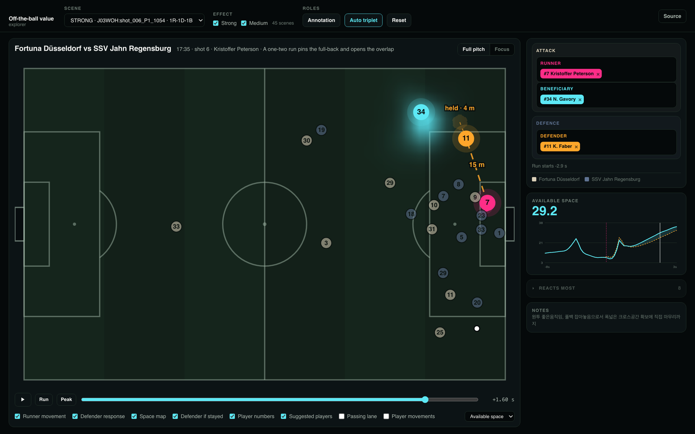
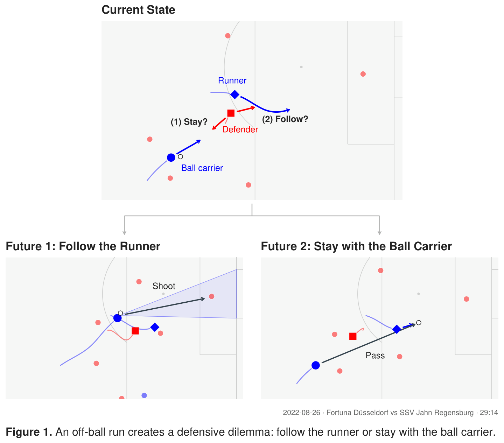
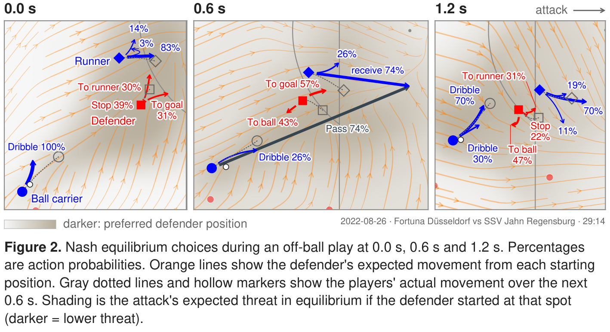

# The Defender’s Dilemma: Game-Theoretic Evaluation of Off-Ball Movement in Soccer

**Kyuhyeok Seo**, **Chan-Eui Song**, **Andrew Kang**, **Priya Narasimhan**, **James Z. Wang**

An off-ball run can force a defender to choose between following the runner and covering another
attacker. We extract such situations from Bundesliga tracking data, model each as a small game between
two attackers and one defender, and solve it for its Nash equilibrium every 0.6 s of the play. The
equilibrium shows how both sides should move when each can respond to the other.

## Demo

**[Open the interactive demo](https://chani-song.github.io/offball-value/)**



## Key figures



[PDF](docs/assets/figure1_ssac.pdf)



[PDF](docs/assets/figure2_ssac.pdf)

## Overview

The paper studies 2v1 situations: the runner, the teammate who could benefit from the run, and the
defender responsible for the runner. The code distinguishes two cases. When the teammate who benefits
is the ball carrier, the game is a 2v1 between the ball carrier, the runner and the defender
(`andrew-passer2on1/`). Otherwise the ball carrier becomes a scripted passer who follows his real path
and only passes, and the runner and the beneficiary play against the defender (`andrew-fixedpasser/`,
called 3v1 in the code).

Both game packages build on a finite-game solver by Andrew Kang (`defensive_positioning`). It is not
part of this repository ([docs/reproduction.md](docs/reproduction.md#solver-base)).

## Method

**Scenes.** Run onsets are detected inside settled attacking possessions of the seven IDSSE matches
(a 25 degree change of direction with a 1.5 m/s gain in speed). Each scene has a runner, the defender
responsible for him and a beneficiary, the teammate who gains if the defender follows the runner. A
rule assigns these roles in pipeline scenes. In annotated scenes they come from the annotator's labels.

**Game.** Three simultaneous decisions of 0.6 s each (a 1.8 s horizon). The defender chooses among five
movement commands: stop, or one of four directions relative to the attack. The attack chooses a joint
command for its two players or a pass. Pass candidates are aimed along the receiver's run. All movement
respects speed-up, braking and turning limits measured from the same tracking (99.9th percentile).
Everyone else follows his real tracked path. In 2v1 games the other defenders can still tackle the ball
carrier. A pass is worth its completion probability times a hand-designed positional threat at its
target. Completion comes from a pass model fitted on our own passes, with each match held out.

**Solution.** The game is zero-sum and finite. It is solved backwards with a linear program at every
decision state. Every solution is checked against unrestricted best responses for both sides: the
certificate gap must be within the solver's tolerance. The solution is a behaviour strategy, a mixed
choice at every decision state. Each real moment (0.0, 0.6 and 1.2 s after the start) is solved as its
own game.

Probabilities reported by the code and drawn in the figures are the probability mass the equilibrium
strategy assigns to an action. They are not pass-completion probabilities, and they are not the
probability that an action is correct.

The design of each game is in `andrew-passer2on1/DESIGN.md` and `andrew-fixedpasser/DESIGN.md`.

## Results

The evaluation set has 26 scenes from the rated pool: 7 from a team member's annotated shot clips and
19 from the pipeline. That gives 69 real moments and 207 player decisions.

The abstract reports two results:

| Result in the abstract | Source | Checked here |
| --- | --- | --- |
| The equilibrium mixes in 48% of moments | `scripts/analyze_eval.py`: the defender mixes at 33 of 69 moments | yes, from the 2026-09-30 output |
| Optimal attack against the fixed, observed defense exceeds the equilibrium value by 6% on average and up to 21% | `scripts/static_counterfactual.py` and `scripts/summarize_static.py`, `(S - V) / V` | no: the output is not available outside the cluster |

`scripts/analyze_eval.py` also ranks each player's observed option among his five or six options by
its value against the opponent's equilibrium strategy. These numbers are not in the abstract:

| | Observed | Uniform choice |
| --- | --- | --- |
| Median rank of the observed option (ties share places) | 2.0 | 3.0 |
| Mean equilibrium probability of the observed option | 0.31 | 0.19 |

Caveats:

- The observed option is the command whose 0.6 s end point is nearest the player's real position
  (median distance 0.78 m). It is an approximation.
- Ties are common: 42.5% of observed options tie with another option.
- The evaluation set is small, includes the figure scene, and was drawn from scenes selected for a
  dilemma rating.
- The evaluation output files are not in the repository ([docs/data.md](docs/data.md)).

## Repository structure

```text
andrew-passer2on1/    2v1 game package, solver run script, design notes, check scripts
andrew-fixedpasser/   3v1 game package (scripted passer), the same layout
src/offball_value/    tracking loaders, run-onset detection, scene construction
scripts/              pipeline steps, figures, evaluation
jobs/                 SLURM scripts for the solver runs
data/processed/       fitted pass-model coefficients and measured movement limits
data/static/          static EPV grid (from PAUSA, Apache-2.0)
tests/                unit tests
docs/                 reproduction, data, code status; docs/assets/ holds the README images
```

[docs/code_status.md](docs/code_status.md) separates the code on the paper's path from supporting
scripts and from modules left over from earlier formulations, which are kept for now.

## Reproducing

| What | Status |
| --- | --- |
| Unit tests | run from this repository alone (CI) |
| Pass model and movement limits | fitted outputs committed; refitting needs the IDSSE files |
| Scenes, game states, solver runs | need the IDSSE files, the private solver base and a SLURM cluster; the showcase scenes also need team annotation sheets |
| Figure 1 | needs the solver output for S05 and a start sheet that are not in the repository |
| Figure 2 | needs the S05 panels, defender grids and tracking excerpt, which are not in the repository; rendered from the team's copies on 2026-10-01 |
| Evaluation numbers | need the evaluation run's solver output and the IDSSE files |

Commands, inputs and what was checked are in [docs/reproduction.md](docs/reproduction.md).

`docs/assets/figure1_ssac.pdf` and `figure2_ssac.pdf` are the submitted figures; the PNGs are full-page
renders of them. Figure 1 is drawn from the tracking; only its Future 2 panel uses the solver (the
through ball's target and the defender's motion). Figure 2 is solver output. The demo screenshot is
the Nash equilibrium view of the showcase built from branch `chani-ssac-demo-latest-paper` at commit
`ae3f38b`.

## Data

The tracking and event data are IDSSE (Bassek et al., 2025; CC BY 4.0; data owner DFL). Download them
separately into `data/raw/bundesliga-integrated/`. The repository includes only fitted coefficients
and measured limits derived from them, plus the README images. [docs/data.md](docs/data.md) lists what
is included, what is not and why, and which steps need which inputs.

## Installation

Python 3.11.

```bash
./bootstrap.sh
PYTHONPATH=src .venv/bin/python -m unittest discover -s tests
```

`requirements.txt` pins the versions the tests were run with. The solver packages also need the solver
base cloned into `andrew/` ([docs/reproduction.md](docs/reproduction.md#solver-base)).

## Citation

See [CITATION.cff](CITATION.cff). Please also cite the IDSSE dataset ([docs/data.md](docs/data.md)).

## License

No license has been chosen for this code yet, so it is not licensed for reuse. The solver base it
imports is in a private repository without a license. `data/static/EPV_grid.csv` is Apache-2.0
(PAUSA).
